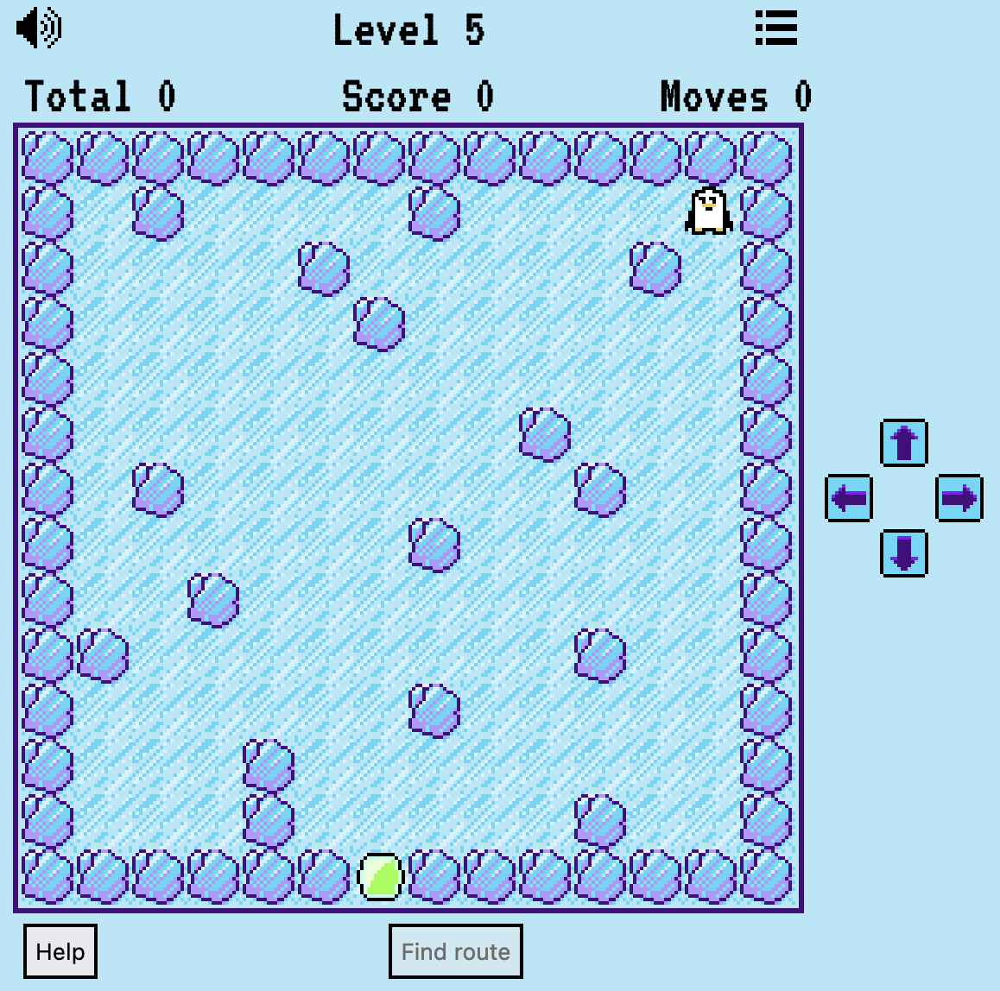
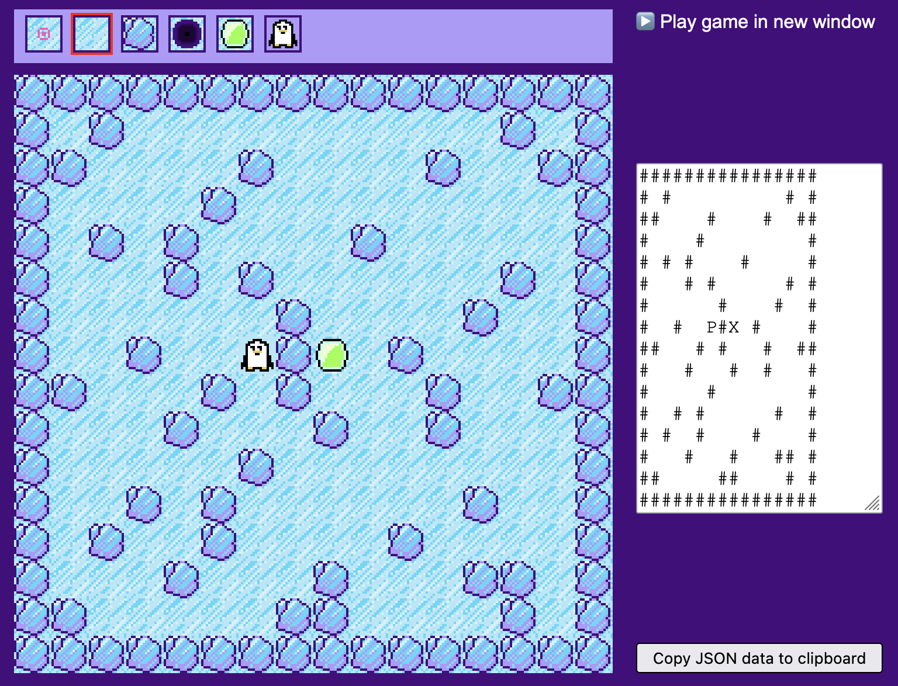
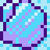

# Rutschpartie

**Mini-Game, das von Pokémon Crystal Ice Path inspiriert ist**

Schubse den Pinguin Chilly mit den wenigsten Zügen zum Ziel. Der eisige Boden ist so schlittrig, dass er nur an Hindernissen zum Halt kommt, wenn er erst mal in Fahrt ist. Fällt er in ein Loch hinein, taucht er am anderen wieder auf.

Wenn du so gar nicht weiter weißt, kannst du auf „Help“ drücken, um dir den optimalen Pfad anzeigen zu lassen.

## Gameplay

Level 5 ist ein einfacher Level. Aber wenn man einfach drauflos rutscht, statt über den idealen Weg nachzudenken, kann es schnell passieren, dass man nur zwei von drei Sternen oder weniger bekommt:

## Editor

Zum Spiel gehört ein Editor, mit dem du bestehende Levels verändern und neue erfinden kannst.

Standardmäßig legt „New game“ einen 20 Felder breiten und hohen Level an. Die Größe kannst du über die Eingabefelder darunter ändern.

| Field  | Meaning |
| - | - |
|  | Damit kannst du den Weg markieren, den Chilly nehmen soll. Die Marker sind nur eine Gedankenstütze für dich; im Spiel erscheinen sie als normale Eisfläche. |
 |  | Es ist Eis, kalt und glatt. So glatt, dass ein darübergleitender Chilly erst dann stoppt, wenn er gegen einen Fels dotzt oder in ein Loch fällt. |
 |  | Der harte Fels bremst den schlitternden Chilly abrupt ab 0 ab. |
 |  | Wenn du Münzen in einen Level packst, veränderst du ihn damit komplett. Das Einsammeln einer Münze schreibt dem Spielerkonto 5 Punkte gut. |
 |  | Anders als im richtigen Leben sind diese Löcher nicht lebensgefährlich. Fällt Chilly in eines hinein, taucht er am anderen sofort wieder auf. Diese Formulierung legt schon nahe, dass es nur genau zwei Löcher (oder keines) in einem Level geben darf. |
|  | Der Ausgang. Hierhin muss Chilly manövriert werden. |
|  | Der mutige Chilly. Es kann nur einen geben – pro Level. |
|  | Das leere Feld kannst du vorerst ignorieren. |

Die drei Eingabefelder unterhalb der „Thresholds“-Schaltfläche enthalten die Anzahl der Züge, die der Spieler maximal benötigen darf, um drei, zwei oder einen Stern am Level-Ende zu erhalten. Das Feld „Points to earn“ gibt an, wie viel Punkte das Absolvieren des Levels dem Spieler einbringt. Diese Zahl wird mit der Anzahl erhaltener Stern für den endgültigen Level-Score multipliziert. Der in den Editor eingebaute Solver füllt diese drei automatisch mit sinnvollen Werten. Du kannst sie beliebig ändern, bevor du den fertigen Levels in Spiel integrierst.

Um einen Level ins Spiel einzubauen, bedarf es zweier Schritte: Zuerst musst du die Level-Daten per „Copy JSON data to clipboard” in die Zwischenablage kopieren. Von dort aus kannst du sie an der gewünschten Stelle im Array `LEVELS` (siehe [index.js](src/index.js)) einfügen.

## Veröffentlichen

Wenn du mit deinen Levels glücklich bist, kannst du das Spiel für die Veröffentlichung paketieren.

Dazu gibt es mehrere Wege. Der erste führt über den Aufruf des Skripts [_bin/pack.sh](_bin/pack.sh). Es legt das Unterverzeichnis „package“ an und kopiert alle für das Spiel benötigten Dateien dort hinein. Diese komprimiert das Skript per 7-Zip und schreibt sie in die Datei rutschpartie.zip.

Diese Dateien kannst du nun auf beliebigem Weg mit anderen teilen, zum Beispiel die Zip-Datei an Freunde mailen oder den Verzeichnisinhalt über deinen Webserver veröffentlichen. Wenn du einen eigenen Webserver hast, wirst du wissen, wie man Dateien dorthin kopiert.

Den zweiten Weg beschreitest du mit dem Skript [_bin/deploy.sh](_bin/deploy.sh). Es legt das Verzeichnis „deploy“ an, kopiert aber nicht einfach alle benötigten Dateien dorthin, sondern „minifiziert“ sie zuvor, sodass sie schneller durch die Leitung rauschen, wenn ein Browser sie vom Webserver abruft. 

## Trivia

Wie Chilly zu seinem Namen gekommen ist: [das Gespräch mit ChatGPT](https://chat.openai.com/share/bac5dec0-1a97-4430-8714-938811e16821).

## Lizenz

Diese Software steht unter der [MIT-Lizenz](LICENSE).

Copyright ©️ 2023 [Oliver Lau](mailto:oliver.lau∀gmail.com)

-----

## Literatur

 - Oliver Lau, Rettet den Pinguin!, [c’t 19/2023, S. 56](https://www.heise.de/select/ct/2023/19/2318608564017863443)
 - Oliver Lau, Dreifache Chance, [c’t 21/2023, S. 54](https://www.heise.de/select/ct/2023/21/2319407263017212334)
