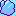

**Für die deutsche README siehe [LIESMICH.md](LIESMICH.md).**

# Glissade

*A mini-game inspired by Pokémon Crystal Ice Path*

Push Chilly, the penguin, through his icy maze to guide him to the exit using the path with the fewest moves. The ground is so slippery that he can only stop at obstacles. If he falls down one hole, he reappears at the other. 

If you’re totally clueless about the perfect path you can press “Help” to display directional arrows that lead to the exit.

# Gameplay

It’s easy to miss the perfect path if you don’t think ahead:

https://github.com/607011/glissade/assets/2240271/9e00c150-b5bb-4559-b994-e9ba596a5cce

## Editor

The game comes with an editor that you can use to edit existing levels or create new ones.

Simple levels don’t have holes:

You can make a level more difficult by connecting a lot of holes to one another:

By default, a »New game« will be 20 fields wide and 20 fields high. You can change the dimensions in the two input fields below the button.

| Field  | Meaning                                       |
| ------ | --------------------------------------------- |
|  | Use it to sprinkle breadcrumbs as a reminder for yourself which path Chilly is supposed to take. The markers will display as regular Ice fields in the game. |
|  | Ice, ice, baby! It's so slippery that once the player pushes Chilly he will not stop before he hits a rock or falls down a hole. |
|  | The rock is hard as rock. It will abruptly stop the penguin’s motion. |
|  | Yeah! Make Chilly the richest of his kind. Each time he collects a coin the player’s score increases by 5 points. |
|  | It’s dark and cold, but it’s not dangerous. If Chilly falls down one hole he dives to a certain other hole and reappears there. |
|  | The exit. The place where Chilly needs to be pushed to. |
|  | The grand Chilly himself. Of course only one instance of him is allowed per level. |
|  | An empty field. Ignore it. |

The input fields below “Thresholds” hold the maximum number of moves allowed to earn three, two or one stars. The field “Points to earn” speaks for itself. The solver automatically fills these fields with sensible values, but you can change them before embedding the level into the game.

To embed the level into the game, press the “Copy JSON data to clipboard” button to copy the level data to the clipboard. Now you can insert the level data at the desired location below `<script id="levels" type="application/json">` in [index.html](src/index.html).

## Trivia

How Chilly got his name (German): https://chat.openai.com/share/bac5dec0-1a97-4430-8714-938811e16821 

## License

See [LICENSE](LICENSE).
